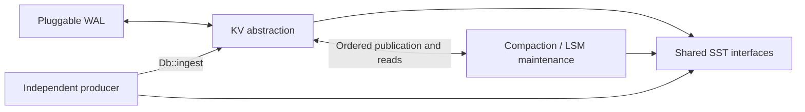

# SlateDB Standalone SST Writing and Ingestion

Table of Contents:

- [Summary](#summary)
- [Motivation](#motivation)
- [Goals](#goals)
- [Non-Goals](#non-goals)
- [Design](#design)
- [Impact Analysis](#impact-analysis)
- [Operations](#operations)
- [Testing](#testing)
- [Rollout](#rollout)
- [Alternatives](#alternatives)
- [Open Questions](#open-questions)
- [References](#references)

Status: Draft

Authors:

* [kumarUjjawal](https://github.com/kumarUjjawal)

## Summary

This RFC adds a public SST writer and an ingestion API for files created outside
a running database. Applications can prepare sorted data in their own memory
structures, then let SlateDB manage the resulting files. Ingestion assigns write
order through the manifest without rewriting the stored records.

## Motivation

[Issue #1143](https://github.com/slatedb/slatedb/issues/1143) requests SST creation
outside a running database, allowing sorted data to bypass the normal write
path. SlateDB already has `EncodedSsTableWriter` and public reading interfaces,
but their paths and ownership assume database-managed files.

The broader goal is a replaceable KV layer. Applications in
[issue #1105](https://github.com/slatedb/slatedb/issues/1105) accumulate updates in
`Vec<Sample>` or bitmaps and encode them at flush time. Shared file interfaces
let them reuse SlateDB's format and LSM maintenance, although coordinating
queries across active memory, frozen memory, and files requires a further contract.

This proposal is intended to replace the standalone-writer design in
[RFC #1146](https://github.com/slatedb/slatedb/pull/1146), by
[KarinaMilet](https://github.com/KarinaMilet). It incorporates the requested
package boundary and concrete SlateDB ingestion design, with manifest growth
as the first implementation experiment.

## Goals

- Expose SST interfaces independent of the KV memory representation.
- Define ingestion ordering, visibility, durability, and retries.
- Preserve snapshot, recovery, and GC guarantees.
- Bound and measure additional manifest data.

## Non-Goals

- Define KV provider traits, replace the memtable, or introduce renewable read checkpoints.
- Support foreign formats, custom comparators, or source database histories.
- Add segmented ingestion, atomic multi-file imports, or independent manifest writers.

## Design

### Component Boundary

| Component | Responsibility |
| --- | --- |
| WAL | Persist ordered operations and provide replay input. |
| KV abstraction | Apply operations, manage memory, and query memory and published data. |
| Compaction/LSM maintenance | Expose file views and manage publication, compaction, and GC. |

`slatedb-sst` owns file encoding and access. KV and LSM coordination remain in
`slatedb`, where the fenced writer orders publication against writes and WAL
progress, including files supplied by external producers.



Independent ingestion assigns destination sequences to prebuilt files. A KV
flush instead preserves assigned sequences and transfers WAL coverage from
memory to files. Its follow-up contract must coordinate frozen-generation
ownership, snapshot retention, memory accounting, and queries across memory and
files, including `DbReader`. The ingestion protocol does not replace that contract.

### SST Interfaces

The standalone reader and writer reuse SlateDB's SST code independently of a
running database. Sequence assignment and publication remain with the database
writer.

```rust
pub enum SstSequenceMode {
    Preserve,
    Deferred,
}

impl SstWriter {
    pub fn new(
        store: Arc<dyn ObjectStore>,
        path: Path,
        options: SstWriterOptions,
    ) -> Result<Self, Error>;

    pub async fn add(&mut self, entry: RowEntry) -> Result<(), Error>;
    pub async fn close(self) -> Result<SstArtifact, Error>;
}

impl SstReader {
    pub fn new_with_cache_scope(
        root_path: Path,
        store: Arc<dyn ObjectStore>,
        cache: Arc<dyn DbCache>,
        db_cache_id: u64,
        block_transformer: Option<Arc<dyn BlockTransformer>>,
    ) -> Self;

    pub async fn open_at(&self, path: Path, id: Ulid) -> Result<SstFile, Error>;
}
```

Each writer produces one file. `SstWriterOptions` selects the sequence mode,
supported format version, compression, filters, and block transformation:

| Mode | Record contract | Publication |
| --- | --- | --- |
| Preserve | Supplied sequences and timestamps, including versions and merge operands | Standalone creation and inspection only until a flush or history-mapping contract exists |
| Deferred | Sequence zero, one value or tombstone per key, no timestamps | `Db::ingest` |

Keys ascend in byte order, with versions in descending sequence order. Validation
rejects unordered records, duplicate key-sequence pairs, empty files, format-limit
violations, and records outside the selected mode before calling
`EncodedSsTableBuilder::add`, whose unchecked ordering assumptions can cause
panics or invalid indexes.

`SstArtifact` contains the `SsTableHandle`, path, exact byte size, row count from
`SstStats::num_rows()`, encoded-file SHA-256 digest, and optional object version.
`close()` completes upload and returns the artifact while leaving source
ownership with the producer. Failure returns no artifact and attempts an abort,
with surviving cleanup left to the producer.

Artifacts use versioned JSON to exchange file metadata across processes and
releases, with unsupported versions rejected. A SHA-256 digest binds a trusted
descriptor to the file bytes and identifies retry input.

The writer allocates a fresh physical ULID regardless of path. `open_at` takes
that ID explicitly, or a fresh ID when no artifact exists. Within a cache scope,
an ID identifies immutable bytes under one decoding configuration.
`new_with_cache_scope` applies `db_cache_id` to all block and metadata operations.
Different stores or decoding configurations require distinct scopes when sharing
a cache. Existing `SstReader::new` retains scope zero for compatible users, and
`open(id)` and `open_with_handle` retain database-path behavior.

### Ingestion API

```rust
pub struct SstSource {
    pub artifact: SstArtifact,
    pub store: Arc<dyn ObjectStore>,
    pub block_transformer: Option<Arc<dyn BlockTransformer>>,
}

pub enum IngestSequence {
    Allocate,
    Explicit(u64),
}

pub struct IngestOptions {
    pub request_id: Ulid,
    pub sequence: IngestSequence,
    pub ttl: Ttl,
}

pub struct IngestResult {
    pub sequence: u64,
    pub sst_id: Ulid,
}

impl Db {
    pub async fn ingest(
        &self,
        source: SstSource,
        options: IngestOptions,
    ) -> Result<IngestResult, Error>;

    pub async fn ingest_status(
        &self,
        request_id: Ulid,
    ) -> Result<Option<IngestResult>, Error>;
}
```

Ingestion accepts one deferred artifact with its source store and transformer.
These are inherent `Db` methods, leaving `DbWriteOps` and existing test doubles
unchanged. `ingest_status` reconciles in-flight publication before returning a
stored result or `None`. Errors distinguish invalid input, unsupported policy,
request expiry or reuse, capacity exhaustion, and uncertain publication.

`IngestResult.sst_id` identifies the file originally published, for diagnostics
and correlation with the request outcome. It does not keep the object alive.
Callers read imported data through database APIs because compaction and GC can
replace and remove that file while its successful outcome remains valid.

`Allocate` chooses the next sequence. `Explicit` requires a value above the
current maximum, as with [ordinary writes](https://github.com/slatedb/slatedb/pull/1605).
Applications using an external sequence authority must use it for imports too.
Publication determines precedence for overlapping files, so dependent imports
are submitted and resolved in that order.

Imports initially do not expire. `Ttl::NoExpiry` explicitly bypasses a database
default, while `Ttl::Default` requires no configured default TTL. Both explicit
expiration variants are unsupported. Sequence and TTL options form part of the
request identity.

Imported `create_ts` and `expire_ts` remain absent after compaction, with missing
creation time exposed as zero in `KeyValue`. Filters must handle `None`, without
a blanket restriction on key- or value-based filters. Snapshots retain normal
guarantees, subject to existing compaction-filter limits.

### Ordered Publication

The writer blocks later writes and transaction creation, atomically rejecting
admission if a transaction is active. Concurrent transaction support requires
conflict tracking for imported keys. After earlier writes durably flush through
the normal WAL and memtable paths, ingestion reserves L0 capacity and assigns
its sequence and a fresh destination ID. Reserving after earlier flushes avoids
a reservation deadlock. Compaction continues while admission waits.

The writer reads the source and uploads a copy into database-owned storage,
then rereads the destination to validate its digest, checksums, ordering, record
types, deferred metadata, and format limits. The copy binds to the source version
when available. Copying and validation are inside the initial write pause, with
the source remaining caller-owned.

After upload, one manifest update publishes the view, outcome, and recovery
metadata. For import sequence `s` and monotonic-clock tick `t` obtained after
earlier flushes:

| State | Publication value |
| --- | --- |
| `last_l0_seq` | `s`, above the preceding published sequence |
| `replay_after_wal_id` and WAL progress | Preceding flushes' replay boundary and actual WAL progress |
| `last_l0_clock_tick` | `t`, at least the previous value |
| `recent_snapshot_min_seq` | Minimum active snapshot sequence, or `s`, under existing snapshot-registration coordination |
| `sequence_tracker` | Offer `(s, t)` under existing sampling and retention rules |

The tick does not become a row creation timestamp. The writer installs local
read state and advances committed, database-durable, and LSM-published progress
before success or later writes, independently of the immutable-memtable callback.

Import 101 after WAL write 100 waits for WAL durability through 100, with no WAL
record at 101. Flushing earlier memory prevents replay from skipping uncovered
writes when `last_l0_seq` advances. Snapshot 100 retains the old value, current
reads see import 101, and write 102 supersedes it. `DbReader`, compaction, and
recovery preserve this ordering.

### Manifest Representation

Sequence interpretation belongs to `CompactedSsTableView`:

```fbs
table CompactedSsTableView {
    id: Ulid (required);
    sst_id: Ulid (required);
    visible_range: BytesRange;
    sequence_override: ulong = null;
}
```

Absent overrides preserve stored sequences. Populated overrides apply one
sequence to every record before snapshot filtering or version and merge
resolution. Translation occurs above raw caches, while standalone `SstReader`
exposes physical metadata.

Compaction materializes effective sequences and omits output overrides. Jobs
with overridden inputs cannot use trivial moves, which would retain unchanged
records in sorted runs. Checkpoints, clones, projected views, and serialized
compaction inputs preserve overrides while referencing original files.

### Durable Retries

`ManifestV2` in `schemas/manifest.fbs` gains `ingest_outcomes: [IngestOutcome]`
under manifest format version 3:

```fbs
table IngestOutcome {
    request_id: Ulid (required);
    request_fingerprint: [ubyte] (required);
    sequence: ulong;
    sst_id: Ulid (required);
}
```

The 32-byte fingerprint hashes the source digest and canonical sequence/TTL
options. Identical bytes can come from another path. A matching request returns
its stored outcome before new sequence validation, including an explicit sequence
now below the destination maximum. A different fingerprint fails.

The proposed limits are 1,024 stored outcomes and a 24-hour retry window from
the caller-minted request ULID. IDs over five minutes ahead of the database clock
are rejected. Expiry remains the embedded timestamp plus 24 hours, allowing at
most five extra minutes. Expired IDs fail both ingestion and status lookup even
if no record remains. An expired request can have committed, so a new ID can
overwrite intervening writes and is never an automatic retry.

Ordinary L0 flushes and imports share pruning logic: remove outcomes expired at
the `last_l0_clock_tick` committed by that update before checking capacity and
inserting an import outcome. Pruning does not advance the clock independently.
A full collection rejects new imports without evicting valid outcomes. Other
manifest writers preserve it. Pruning and clock advancement commit together so
recovery cannot reopen an expired window. Request validity is rechecked before
publication and manifest retries, and concurrent calls sharing an ID serialize.

Outcomes survive compaction but GC must exclude them from file references.
Retries can return the original SST ID after its object is collected. Unknown
publication outcomes block later publication until reconciliation or recovery,
even after caller cancellation. Recovery returns recorded outcomes or recopies
uncommitted requests under fresh destination IDs, avoiding stale L0 timestamps.
During an attempt, later L0 publication cannot pass the import and bytes under an
ID remain immutable, following [RFC 0029](0029-gc-safe-sst-ulid-timestamps.md).

## Impact Analysis

### Core API & Query Semantics

- [x] Basic KV API (`get`/`put`/`delete`)
- [x] Range queries, iterators, seek semantics
- [ ] Range deletions
- [x] Error model, API errors

### Consistency, Isolation, and Multi-Versioning

- [x] Transactions
- [x] Snapshots
- [x] Sequence numbers

### Time, Retention, and Derived State

- [x] Logical clocks
- [x] Time to live (TTL)
- [x] Compaction filters
- [x] Merge operator
- [x] Change Data Capture (CDC)

### Metadata, Coordination, and Lifecycles

- [x] Manifest format
- [x] Checkpoints
- [x] Clones
- [x] Garbage collection
- [x] Database splitting and merging
- [x] Multi-writer

### Compaction

- [x] Compaction state persistence
- [x] Compaction filters
- [x] Compaction strategies
- [x] Distributed compaction
- [x] Compactions format

### Storage Engine Internals

- [x] Write-ahead log (WAL)
- [x] Block cache
- [x] Object store cache
- [x] Indexing (bloom filters, metadata)
- [ ] SST format or block format - physical layout is unchanged.

### Ecosystem & Operations

- [x] CLI tools
- [x] Language bindings (Go/Python/etc)
- [x] Observability (metrics/logging/tracing)

## Operations

### Performance & Cost

An override adds eight payload bytes per populated view. L0 admission limits and
compulsory rewriting bound live overrides by admitted L0 views in an unsegmented
destination. Projections, clones, and retained manifests need separate accounting.

Outcome payload is 72 bytes: two 16-byte IDs, a 32-byte fingerprint, and an
eight-byte sequence, totaling 72 KiB at the 1,024-record cap. The cap also limits
imports within the retry window. `Ulid` tables add offsets, headers, and vtable
overhead, while the fingerprint vector adds an offset and length. These are
payload estimates, not measured encoded sizes.

The first experiment compares equivalent current and proposed manifests with
absent/populated overrides at configured L0 limits and stress cases of 1,000,
10,000, and 100,000 views. Include empty/full outcome collections, realistic key
bounds, projections, and retained checkpoints. Compare table and fixed-width
struct encodings for new outcomes without altering existing ID fields. Report
encoded bytes per view/request, total size, encode/decode time, decoded memory,
and cumulative traffic from full manifest updates.

For a file of `S` bytes, copying and rereading transfer about `3S` with cold
object-store access, compared with `S` for a normal L0 SST upload. Budget two
full-file GET passes and one PUT upload, plus manifest traffic. Ranged reads
and multipart uploads can split these into several requests. This comparison
excludes source creation, WAL traffic, retries, and compaction. Keeping both the
caller-owned source and destination copy stores roughly `2S` before compaction,
until the caller deletes the source.

Writer memory includes index and filter buffers. Benchmark digest computation,
copying, full validation, write pauses, read-time translation, and compulsory
compaction rewrites against normal batch writes before claiming a benefit.

### Observability

`Settings::enable_sst_ingestion` defaults to `false` and controls admission of
new imports. When disabled, matching retries can still return stored outcomes,
and `ingest_status` remains available under the normal retry-window rules.
Reading and compacting existing imports remain enabled.

Track import bytes and pauses, validation/publication failures, uncertain
outcomes, capacity rejections, retained outcomes, and manifest size. Report
committed, database-durable, WAL, and LSM-published progress separately, with
request IDs and publication results in reconciliation logs.

### Compatibility

Re-export existing `SstReader`, `SstFile`, `SstIndex`, `RowEntry`,
`ValueDeletable`, `SstStats`, and `BlockStats` paths from `slatedb`, preserving
type identity without circular dependencies. Export `SsTableHandle`,
`SsTableId`, `SsTableInfo`, `SstType`, and `FilterFormat` from both crates.
Move `CompressionCodec` into `slatedb-sst`, retaining its
`slatedb::config::CompressionCodec` re-export and forwarding the existing
compression features.
Keep the format-version field private with a public
`SsTableHandle::format_version(&self) -> u16` accessor.

Manifest format version 3 uses the extended `ManifestV2` FlatBuffers table.
The decoder retains version 1 through `ManifestV1` and version 2 through
`ManifestV2`, with absent new fields taking their defaults. The version prefix
changes so old consumers reject overrides they would otherwise ignore. Bump
the compaction-state version for the same reason. Upgrade
readers, writers, compactors, workers, CLI consumers, and binding runtimes before
enabling ingestion. New code reads existing formats. Disabling ingestion does
not permit downgrade while new-format metadata or retained checkpoints remain.

All readers and compactors must retain compatible source encoding and block
transformation for the file's lifetime. This is a deployment obligation because
the manifest does not record transformer configuration. Imports bypass WAL-based
CDC, requiring application notification or a resnapshot for those consumers.

Existing binding APIs and ordinary read-checkpoint behavior remain unchanged.
CLI inspection exposes new metadata, while ingestion bindings are deferred.
Artifact JSON versioning remains independent of Rust types and SST formats.

## Testing

- **SST contracts**: Round-trip both modes, paths, versions, merges, tombstones, transformers, stats, and digests. Reject invalid modes, duplicates, empty files, and decreasing prefix keys before builder access. Test shared-cache scope isolation.
- **Visibility**: Import 101 after WAL 100 with no later write, then add write 102 while retaining snapshot 100. Verify durability waits and `DbReader`, compaction, and restart behavior.
- **Metadata**: Check clock, snapshot, tracker, and replay values, cloned/projected views, compaction-state round trips, and exclusion of trivial moves.
- **Failures and GC**: Inject upload/publication failures, lost responses, and cancellation. Retry after restart and newer L0 publication. Run GC during stalled copies and after compaction removes an SST whose outcome remains valid. Retry must return that outcome without recreating the SST.
- **Retries and simulation**: Exercise reuse, skew, expiry, pruning by flushes/imports, full capacity, transaction admission, and clock recovery alongside writes, compaction, and GC.
- **Compatibility**: Test exports and compression features, version access, unchanged `DbWriteOps`, artifact JSON, manifest versions 1/2/3, old-reader rejection, TTL options, absent timestamps, and unsupported destinations. With ingestion disabled, reject new imports while preserving stored-outcome retries, status lookup, reads, and compaction.
- **Performance**: Run the manifest and ingestion experiments above.

## Rollout

### Implementation

1. Measure manifest overrides and bounded outcomes.
2. Move shared types and errors, retaining re-exports.
3. Separate `TableStore` I/O from its database dependencies.
4. Extract isolated file code into `slatedb-sst`.
5. Add writer validation, versioned artifacts, and digests.
6. Add standalone reader paths and cache scopes.
7. Propagate versioned overrides through reads, compaction, and retained metadata.
8. Add ordered publication and durable reconciliation behind `Settings::enable_sst_ingestion`.
9. Expose ingestion/status APIs with recovery and compatibility coverage.

Standalone interfaces can ship first. Publication must accommodate the
prepared-flush work in [PR #2044](https://github.com/slatedb/slatedb/pull/2044)
without depending on its current proposal. Enable ingestion only with compatible
consumers, and document ownership, retry expiry, TTL, transformers, CDC, and upgrades.

## Alternatives

### Normal Batch Writes or Writer-Only Release

[PR #1746](https://github.com/slatedb/slatedb/pull/1746) improved batches, while
[PR #1757](https://github.com/slatedb/slatedb/pull/1757) explored further changes.
Both retain the lifecycle but still pass data through database memory. A
writer-only release is useful, although specifying ingestion now settles
destination ownership and sequencing.

### Pluggable Memtables or Container Selection

The [enum proposal in #1105](https://github.com/slatedb/slatedb/issues/1105#issuecomment-3666770779)
selects `SkipMap`, `BTreeMap`, or `Vec` without trait dispatch on writes.
Native aggregation also needs consistent memory queries, replay, emitted records,
and merges, as [OpenData](https://github.com/opendata-oss/opendata/pull/29#discussion_r2676527964)
illustrates. The KV follow-up must compare these costs and define the full
handoff, beyond a callback such as [PR #1315](https://github.com/slatedb/slatedb/pull/1315).

### Rewrite or Translate Imports

Rewriting embeds destination sequences and timestamps at encoding cost. A
per-view timestamp default adds interpretation metadata and still needs expiration
rules. Sequence offsets preserve source order but require overlap, bounds, and
snapshot semantics. [Existing-SST reuse](https://github.com/slatedb/slatedb/issues/1143#issuecomment-3693847059)
and database merges, including
[FLINK-31238](https://issues.apache.org/jira/browse/FLINK-31238), therefore need a
history contract beyond the view machinery in [PR #593](https://github.com/slatedb/slatedb/pull/593).

## Open Questions

1. Do the 24-hour window, five-minute skew tolerance, and 1,024-outcome cap fit expected workloads, or is separate request storage needed?
2. What encoded manifest growth and decode cost are acceptable, including retained copies?
3. Does the first adopter require import-time timestamps and TTL?
4. Which `TableStore` dependencies need shared types versus database-side adapters?

## References

- [Issue #1143](https://github.com/slatedb/slatedb/issues/1143) and [RFC #1146](https://github.com/slatedb/slatedb/pull/1146), by [KarinaMilet](https://github.com/KarinaMilet).
- RFC #1146 requests for the [package boundary](https://github.com/slatedb/slatedb/pull/1146#discussion_r2649290355), [reader paths](https://github.com/slatedb/slatedb/pull/1146#discussion_r2649289303), [returned handle](https://github.com/slatedb/slatedb/pull/1146#discussion_r2674413603), and [SlateDB manifest representation](https://github.com/slatedb/slatedb/pull/1146#discussion_r2674447687).
- Related implementation context: [streaming L0 flushes](https://github.com/slatedb/slatedb/pull/2064) and the [file-identification question](https://github.com/slatedb/slatedb/pull/1146#issuecomment-3693976209).
- [Issue #1105](https://github.com/slatedb/slatedb/issues/1105), especially the [read and freeze coordination requirements](https://github.com/slatedb/slatedb/issues/1105#issuecomment-3666587872).
- [Pluggable WAL](0030-pluggable-wal.md), [sequence tracking](0012-sequence-tracker.md), [checkpoints](0004-checkpoints.md), and [GC-safe SST identifiers](0029-gc-safe-sst-ulid-timestamps.md).
- [Segment-oriented compaction](0024-segment-oriented-compaction.md) and [compaction filters](0017-compaction-filters.md).
- [RocksDB file creation and ingestion](https://github.com/facebook/rocksdb/wiki/creating-and-ingesting-sst-files).
- [SST writer](../slatedb/src/tablestore.rs), [standalone reader](../slatedb/src/sst_reader.rs), and [manifest publication](../slatedb/src/memtable_flusher/manifest_writer.rs).
- [File-view schema](../schemas/sst.fbs), [manifest schema](../schemas/manifest.fbs), and [compaction state](../slatedb/src/compactor_state.rs).
